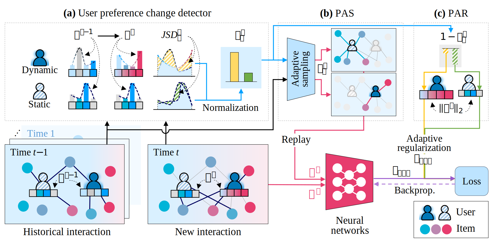

# BPS: A Framework to Balance Plasticity and Stability in Continual Learning for Recommender Systems



## Environment Requirements
- See `requirements.txt`

## File Directory Structure
- `data`: Contains experimental datasets
  - `./data/ml-1m/ratings.dat`
  - `./data/gowalla/Gowalla_totalCheckins.txt`
  - `./data/foursquare/dataset_WWW_Checkins_anonymized.txt`

- `preprocess`: Contains experimental preprocessing results
  - `./preprocess/{data_type}` - Split blocks for dataset
  - `./preprocess/model` - Model weights converted for JSD
  - `./preprocess/jsd` - JSD pre-calculations for BPS

- `model_log`: Stores model weights saved during training
  - `./model_log/{model}/test/`
    - `~segment0` - Base block
    - `~segment1` - Cont block 1
    - `~segment2` - Cont block 2
    - `~segment3` - Cont block 3

- `recall_log`: Stores experimental results
  - `./recall_logs/{model}/{data_type}/BPS/`
    - `~segment_0` - Base block result (last line)
    - `~segment_1` - Cont block 1 result (last line)
    - `~segment_2` - Cont block 2 result (last line)
    - `~segment_3` - Cont block 3 result (last line)

## Command Examples
- **Total Process**
  - Data Preprocessing > Model Preprocessing > JSD Preprocessing > Run BPS

- **Data Preprocess**
  ```bash
  python data_preprocess.py <data_type>  # e.g., ml-1m, gowalla, foursquare
  # Example:
  python data_preprocess.py ./data/ml-1m
  ```

- **Run Only BPS with JSD (Requires Data Preprocessing)**
  ```bash
  python -u run_BPS.py -d <data_type> # e.g., ml-1m, gowalla, foursquare
  # Example:
  python -u run_BPS.py -d ml-1m -bm NGCF -alg BPS -de 0 -e 100 -train_mode sep -log_folder test -log test -save_cp b0_100e -rs full -union_mode snu -replay_ratio 30000 -sampling_mode BPS -patience 2 -lr 5e-4 -first_segment_time 0 -last_segment_time 3 -seed 42
  ```

- **Run Full Training Step by Step (Requires Data Preprocessing)**
  1. Run Model Preprocessing
  ```bash
  python -u model_preprocess.py -d <data_type>  # e.g., ml-1m, gowalla, foursquare
  # Example:
  python -u model_preprocess.py -d ml-1m -bm NGCF -alg Finetune -de 0 -e 100 -train_mode sep -log_folder pre_data -log test_Finetune -save_cp b0_100e -patience 2 -lr 5e-4 -first_segment_time 0 -last_segment_time 3 -seed 42
  ```
  
  2. Run JSD Preprocessing
  ```bash
  python jsd_preprocess.py <data_type>  # e.g., ml-1m, gowalla, foursquare
  # Example:
  python jsd_preprocess.py ml-1m NGCF
  ```
  
  3. Run BPS
  ```bash
  python -u run_BPS.py -d <data_type>  # e.g., ml-1m, gowalla, foursquare
  # Example:
  python -u run_BPS.py -d ml-1m -bm NGCF -alg BPS -de 0 -e 100 -train_mode sep -log_folder test -log test -save_cp b0_100e -rs full -union_mode snu -replay_ratio 30000 -sampling_mode BPS -patience 2 -lr 5e-4 -first_segment_time 0 -last_segment_time 3 -seed 42
  ```
